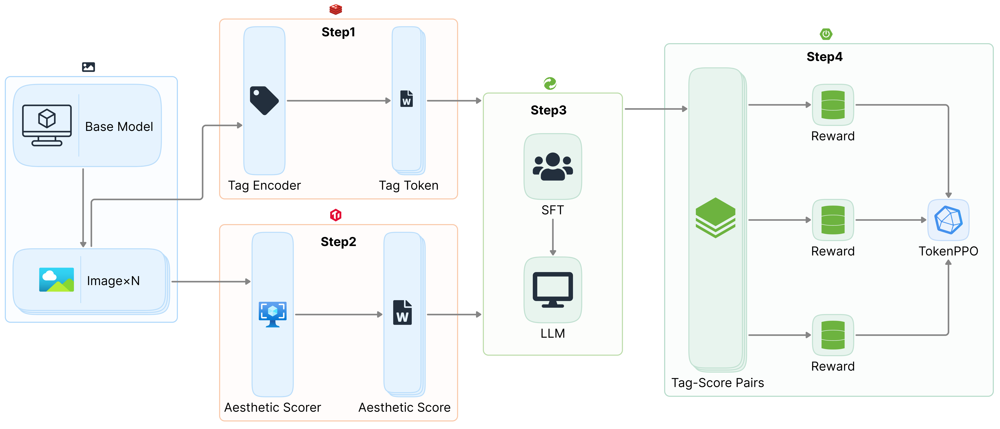

# TokenPPO
Token-Level Reinforcement Learning for Diffusion Model Generation
## Introduction

This repository contains a minimal implementation of TokenPPO,
a reinforcement learning framework designed for token-level control in diffusion-based image generation.

TokenPPO reformulates the Markov Decision Process (MDP) in the token space, combining aesthetic scoring and human preference signals.
This enables fine-grained control of the diffusion process, enhancing both detail fidelity and overall aesthetic quality.

For full details of the method and experiments, see the paper:https://zenodo.org/records/16739433

## Features
Token-Level PPO for diffusion optimization

Aesthetic reward design with hybrid signals

Plug-and-play with existing Stable Diffusion pipelines

Especially effective for anime-style generation

## Aesthetic Scorer Demo

We provide a minimal demo for image aesthetic scoring, combining the anime-aesthetic predictor with WD14 tagger.

Model References

Aesthetic Predictor:[ skytnt/anime-aesthetic (ONNX model)](https://huggingface.co/skytnt/anime-aesthetic/blob/main/model.onnx)

Tagger:[ toriato/stable-diffusion-webui-wd14-tagger](https://github.com/toriato/stable-diffusion-webui-wd14-tagger)

## Training Pipeline
The overall training workflow of **TokenPPO** is illustrated below:

## License

This project is licensed under the Apache 2.0 License.
See https://github.com/ZERO752/TokenPPO/blob/main/LICENSE for details.
